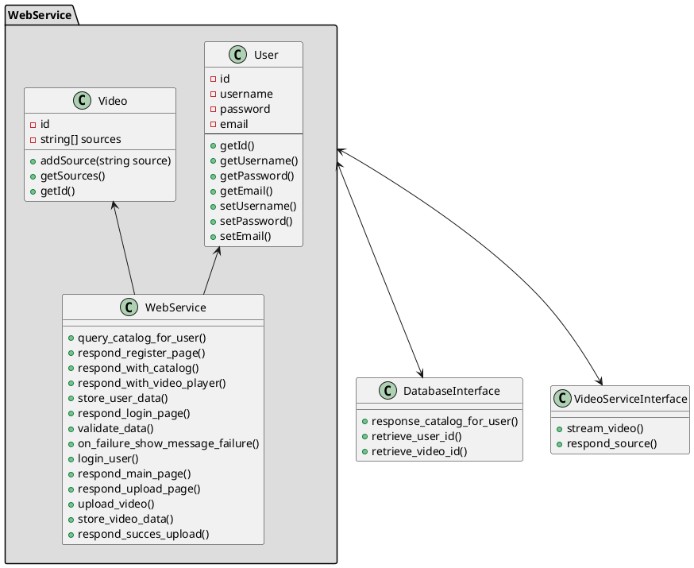
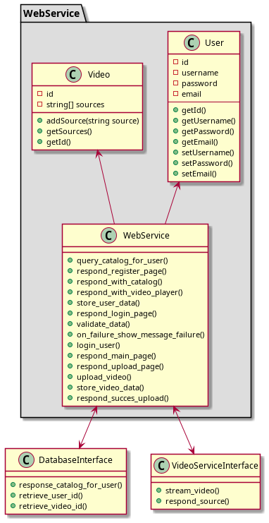
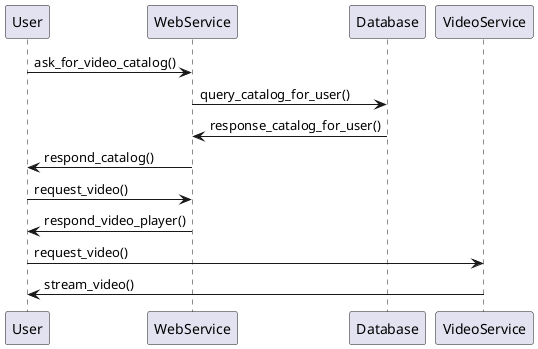
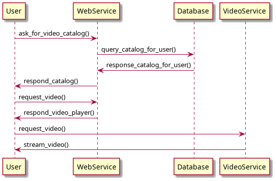
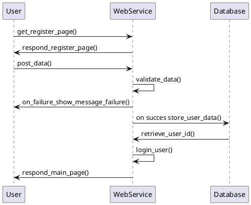
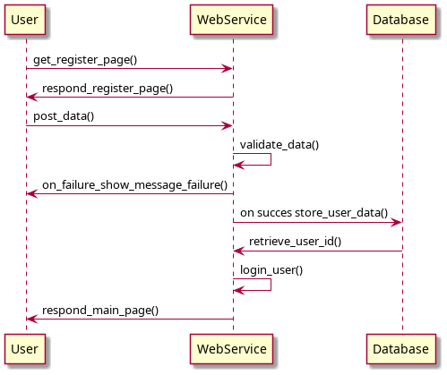
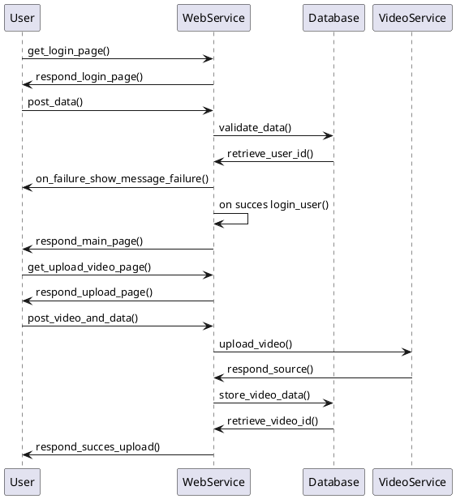
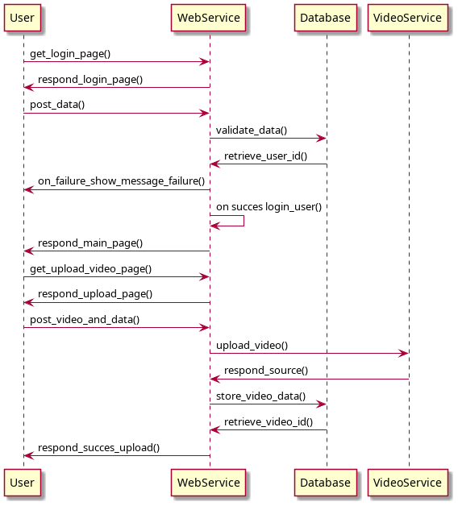

# IS-project

Diagrama de Clases

```plantuml
@startuml
	class DatabaseInterface{
		+ response_catalog_for_user()
		+ retrieve_user_id()
		+ retrieve_video_id()
	}
	class VideoServiceInterface{
		+ stream_video()
		+ respond_source()
	}
Package  WebService #DDDDDD{
	class User {
	- id
	- username
	- password
	- email
	--
	+ getId()
	+ getUsername()
	+ getPassword()
	+ getEmail()
	+ setUsername()
	+ setPassword()
	+ setEmail()
	}
	class Video{
		- id
		- string[] sources
	
		 + addSource(string source)
		 + getSources()
		 + getId()
	}
	class WebService{
		+ query_catalog_for_user()
		+ respond_register_page()
		+ respond_with_catalog()
		+ respond_with_video_player()
		+ store_user_data()
		+ respond_login_page()
		+ validate_data()
		+ on_failure_show_message_failure()
		+ login_user()
		+ respond_main_page()
		+ respond_upload_page()
		+ upload_video()
		+ store_video_data()
		+ respond_succes_upload()
	}

	User <-- WebService
	Video <-- WebService
}
WebService <--> VideoServiceInterface
WebService <--> DatabaseInterface
@enduml
```

Diagrama de Secuencia: watch video

```plantuml
@startuml
User -> WebService : ask_for_video_catalog()
WebService -> Database : query_catalog_for_user()
Database -> WebService : response_catalog_for_user()
WebService -> User: respond_catalog()
User -> WebService : request_video()
WebService -> User : respond_video_player()
User -> VideoService : request_video()
VideoService -> User :stream_video()
@enduml
```

Diagrama de Secuencia: register

```plantuml
@startuml
User -> WebService : get_register_page()
WebService -> User : respond_register_page()
User -> WebService : post_data()
WebService -> WebService : validate_data()
WebService -> User : on_failure_show_message_failure()
WebService -> Database :  on succes store_user_data()
Database -> WebService : retrieve_user_id()
WebService -> WebService : login_user()
WebService -> User : respond_main_page()
@enduml
```

Diagrama de Secuencia: upload video

```plantuml
@startuml
User -> WebService : get_login_page()
WebService -> User : respond_login_page()
User -> WebService : post_data()
WebService -> Database : validate_data()
Database -> WebService : retrieve_user_id()
WebService -> User : on_failure_show_message_failure()
WebService -> WebService :  on succes login_user()
WebService -> User : respond_main_page()

User -> WebService : get_upload_video_page()
WebService -> User : respond_upload_page()
User -> WebService : post_video_and_data()
WebService -> VideoService : upload_video()
VideoService -> WebService : respond_source()
WebService -> Database : store_video_data()
Database -> WebService : retrieve_video_id()
WebService -> User : respond_succes_upload()

@enduml
```

