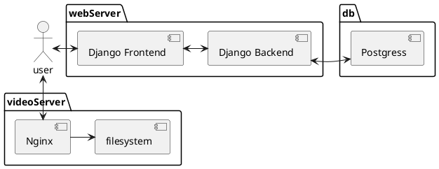

```plantuml
@startuml
actor user

package webServer{
component frontend[
Django Frontend
]
component backend[
Django Backend
]
}

package videoServer{
component Nginx
component filesystem
}

package db{
component psql[
Postgress
]
}


user <-> frontend
user <--> Nginx
frontend <-> backend
backend <-> psql
Nginx -> filesystem
@enduml
```