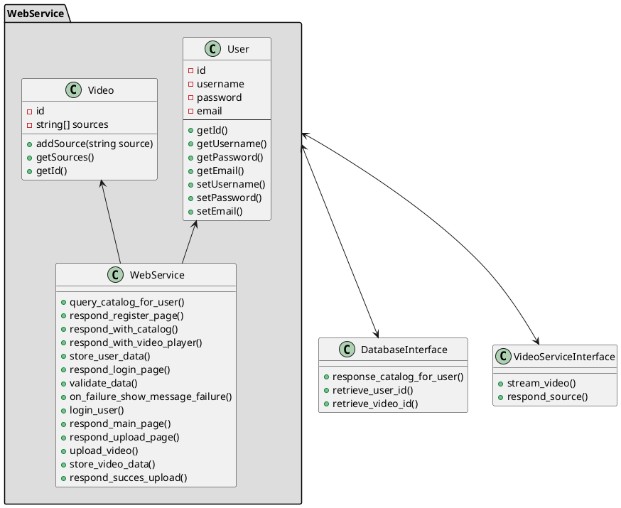

```plantuml
@startuml
	class DatabaseInterface{
		+ response_catalog_for_user()
		+ retrieve_user_id()
		+ retrieve_video_id()
	}
	class VideoServiceInterface{
		+ stream_video()
		+ respond_source()
	}
Package  WebService #DDDDDD{
	class User {
	- id
	- username
	- password
	- email
	--
	+ getId()
	+ getUsername()
	+ getPassword()
	+ getEmail()
	+ setUsername()
	+ setPassword()
	+ setEmail()
	}
	class Video{
		- id
		- string[] sources
	
		 + addSource(string source)
		 + getSources()
		 + getId()
	}
	class WebService{
		+ query_catalog_for_user()
		+ respond_register_page()
		+ respond_with_catalog()
		+ respond_with_video_player()
		+ store_user_data()
		+ respond_login_page()
		+ validate_data()
		+ on_failure_show_message_failure()
		+ login_user()
		+ respond_main_page()
		+ respond_upload_page()
		+ upload_video()
		+ store_video_data()
		+ respond_succes_upload()
	}

	User <-- WebService
	Video <-- WebService
}
WebService <--> VideoServiceInterface
WebService <--> DatabaseInterface
@enduml
```
