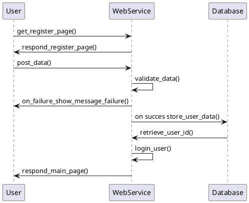

```plantuml
@startuml
User -> WebService : get_register_page()
WebService -> User : respond_register_page()
User -> WebService : post_data()
WebService -> WebService : validate_data()
WebService -> User : on_failure_show_message_failure()
WebService -> Database :  on succes store_user_data()
Database -> WebService : retrieve_user_id()
WebService -> WebService : login_user()
WebService -> User : respond_main_page()
@enduml
```