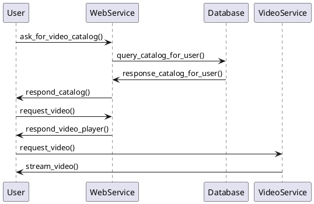

```plantuml
@startuml
User -> WebService : ask_for_video_catalog()
WebService -> Database : query_catalog_for_user()
Database -> WebService : response_catalog_for_user()
WebService -> User: respond_catalog()
User -> WebService : request_video()
WebService -> User : respond_video_player()
User -> VideoService : request_video()
VideoService -> User :stream_video()
@enduml
```
